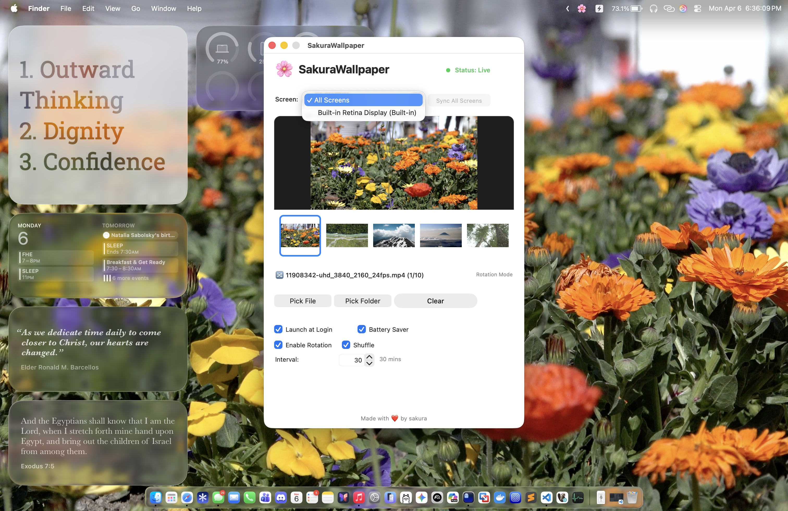
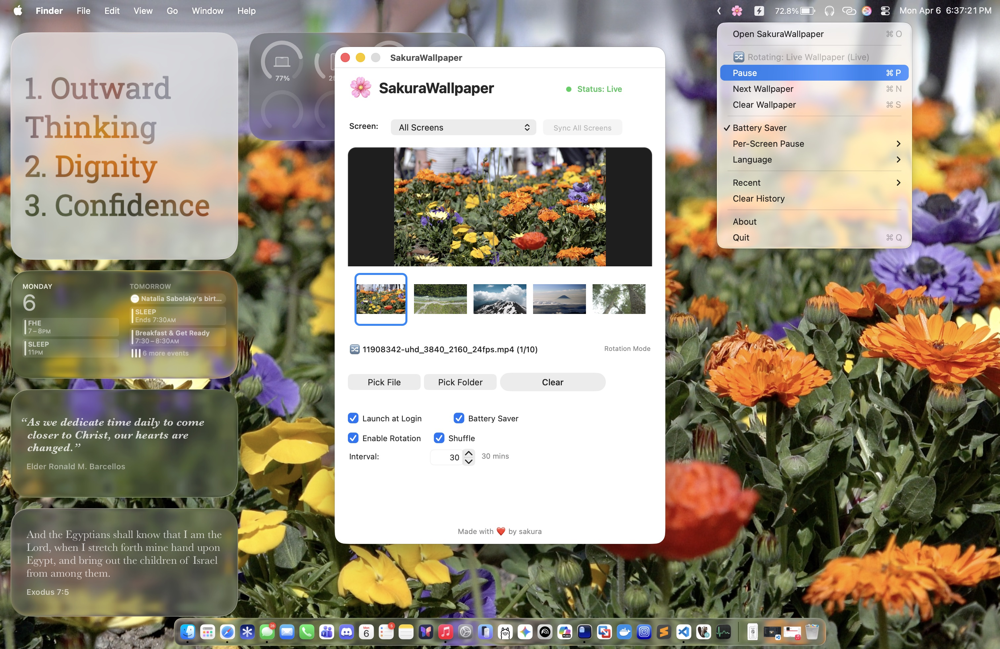

# LivePaper

A lightweight video and image wallpaper application for macOS.
Current version: `v1.0.1`

> LivePaper began as a fork of [SakuraWallpaper](https://github.com/yueseqaz/SakuraWallpaper) by sakura, and is evolving in its own direction. See [Acknowledgments](#acknowledgments).

## Features

- Set videos (MP4, MOV, GIF) or images (PNG, JPG, HEIC, WebP) as desktop wallpaper
- **System Desktop Sync**: Images are applied directly as the system desktop picture; videos sync the currently playing frame to the system desktop on wallpaper changes and lock/screen saver start
- **Rotation Mode**: Select a folder to automatically cycle through wallpapers
- **Per-Screen Independent Rotation**: Each display can keep its own folder path, playlist, interval, and shuffle state
- **Synchronized Linking**: Link screens together to mathematically guarantee their rotation timers switch wallpapers at the exact same millisecond
- **Dual-Preview Mode**: Live playback of the current wallpaper directly within the settings window, alongside an interactive thumbnail grid for folder contents
- **Mission Control Resilience**: Wallpapers seamlessly span across all virtual spaces and instantly recover during monitor reattachments
- **Low Battery Auto Pause**: Automatically pauses wallpaper playback when battery level is at or below 20% and not charging
- Multi-display support with robust monitor detection
- Video wallpaper with automatic loop playback
- Recent wallpapers history for quick switching (supports folders)
- Launch at login support
- Manual Pause/Resume control

## Screenshots






> Note: screenshots predate the rename and may still show the original app name.

## Supported Formats

**Video**
- MP4, MOV, M4V
- GIF (animated)

**Image**
- PNG, JPG, JPEG
- HEIC
- WebP, BMP, TIFF

## Installation

### Build from Source

```
git clone https://github.com/arsabolsky/LivePaper.git
cd LivePaper
./build.sh
open build/LivePaper.app
```

Requirements: macOS 12.0+, Xcode Command Line Tools

## Usage

1. **Drag** a wallpaper file/folder into the preview area, or **click the preview area** to choose in Finder
2. Use the **Interval** stepper to set how often the wallpaper changes (in Rotation Mode)
3. Enable **Shuffle** for randomized order
4. Toggle **Battery Saver** to optimize energy usage while working in other apps or when the screen is off
5. Use the screen dropdown to switch displays (prioritizes built-in displays first)
6. Enable **Link Screens** to synchronize the current display's configuration and rotation timing with other linked screens
7. Click **Stop Wallpaper** to clear the current screen's wallpaper
8. Select a **New Screen Policy** to determine how newly connected monitors should behave (e.g., Inherit Sync Group)
9. Right-click the status bar icon for quick controls

### System Desktop Sync Behavior

- Image wallpapers are pushed to the system desktop immediately
- Video wallpapers snapshot the current playback frame when the wallpaper changes
- Locking the screen or starting the screen saver triggers another sync using the current on-screen content

### Battery Saver Behavior

- When enabled, wallpapers auto-pause only if battery is `<=20%` and the Mac is not charging
- This auto-pause is different from manual pause in the menu

### Status Bar Menu

- **Open LivePaper** - Open main window
- **Status: Live/Manually Paused/Low Battery Auto Paused/None** - Real-time informational readout
- **Pause** - Submenu with `All Screens` and per-screen pause/resume actions
- **Battery Saver** - Enable low-battery auto pause (<=20% and not charging)
- **Next Wallpaper** - Includes `All Screens` plus per-screen next actions (shortcut `n` applies to all screens)
- **Clear Wallpaper** - Reset and remove current selection
- **Recent** - Quick switch to previous wallpapers or folders
- **Clear History** - Clear wallpaper history

## Fix "App is Damaged" Error

If you see "LivePaper is damaged and can't be opened", run this command in Terminal:

```
xattr -cr /Applications/LivePaper.app
```

This removes the quarantine attribute that macOS applies to apps downloaded from the internet.

## System Requirements

- macOS 12.0 Monterey or later
- Supports multiple displays

## Project Structure

```
LivePaper/
├── AppDelegate.swift          # App lifecycle and status bar
├── MainWindowController.swift # Main window UI
├── WallpaperManager.swift     # Wallpaper playback engine
├── ScreenPlayer.swift         # Individual screen player
├── SettingsManager.swift      # User preferences storage
├── Localization.swift         # Localization helper
├── MediaType.swift            # File type detection
├── ThumbnailItem.swift        # Collection view item for previews
├── AboutWindowController.swift # About window
├── main.swift                 # Entry point
├── build.sh                   # Build script
├── AppIcon.icns               # App icon
├── Resources/
│   ├── en.lproj/              # English strings
│   └── zh-Hans.lproj/         # Simplified Chinese strings
├── README.md                  # Documentation
├── LICENSE                    # MIT License
└── .gitignore                 # Git ignore rules
```

## Contributing

Contributions are welcome. Please open an issue or submit a pull request.

## License

MIT License - see [LICENSE](LICENSE) for details.

## Acknowledgments

LivePaper is a fork of [SakuraWallpaper](https://github.com/yueseqaz/SakuraWallpaper), originally created by **sakura** ([@yueseqaz](https://github.com/yueseqaz)). Huge thanks for the original work that made this project possible. ❤️
